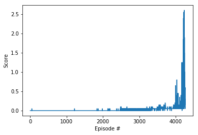

## Report: DDPG for Multi-Agent Reinforcement Learning

### Model and Architecture
DDPG is an Actor-Critic algorithm ideal to train agents in continuous spaces. The Actor is a policy-based method with high variance while the Critic is a value-based method with high bias. The collaboration of these two overcome those obstacles. 

In this implementation, a single Actor-Critic agent is used to train two tennis agents. The Actor is a neural network with 3 fully connected layers with the features 24 > 256 > 256 > 2. Tanh is used in the final layer to map states to actions. The Critic has 4 fully connected layers with features 24 > 256 > 256 > 2 and it maps states and actions to Q-values. A single replay memory is shared across the agents. 

### Hyperparameters

The parameters are shown below:

| Parameter              | Value    | 
| -----------------------|:--------:| 
| Replay buffer size     | 1e6      | 
| Batch size             | 128      |  
| Discount factor        | 0.99     |
| LR_Actor               | 5e-6     |
| LR_Critic              | 6e-6     |
| TAU soft update target | 1e-3     |

### Results
The environment is solved after 4259 episodes:

### Future ideas
As recommended by OpenAI, Proximal Policy Optimization (PPO) may converge faster and would be ideal for more complicated multi-agent in a more complex environment tasks.
